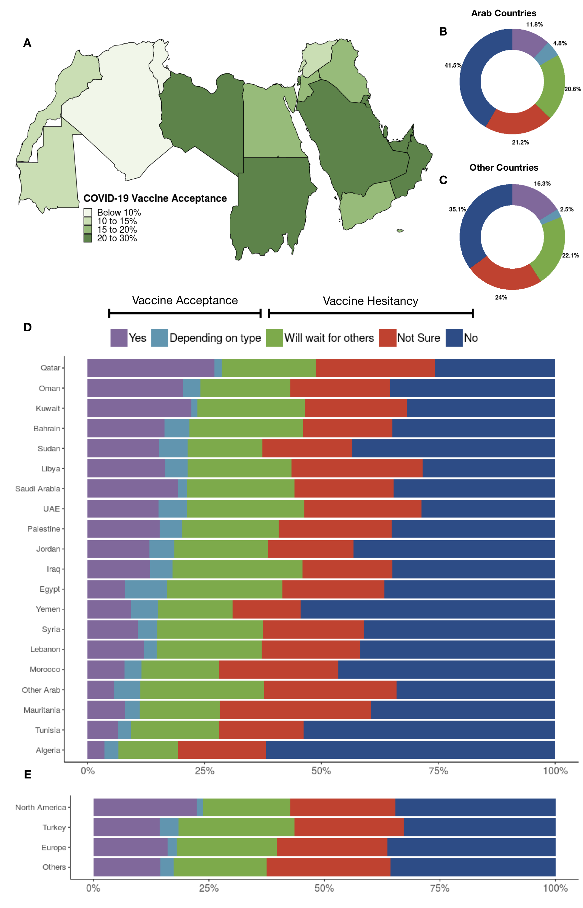

## COVID-19 Vaccine Hesitancy Among Arabs: Data, Code and Survey Results

- This is the reposatory for the data, code and results of the massive online survey of COVID-19 Vaccine Hesitancy Among Arabs.

### How to regenerate the statstics present in the manuscript?
- To regenerate the statstics and figures of Qunaibi et al (submitted), download the [data and code files](Qunaibi-etlal-eLife-2021.zip).
- Install R Markdown pakage and the list of packages on the top of the R markdown file.
- Knit the .rmk file.

### Data description:
- We conducted an online open survey (36,220 eligible participants, 61% males and 39% females) to evaluate vaccine hesitancy among Arabs within and out of the Arab region. Participants covered all 23 countries and territories (n=30,200 participants) and Arabs who live in 122 other countries (n=6,020 participants). Participants from outside Arab countries were clustered based on their country of residence into four clusters (North America, Europe, Turkey and other countries). 
- [Link to the online survey](https://s.surveyplanet.com/kV19lSAck?fbclid=IwAR2wYU5vmKHuT4Te5zrM6Bk4hyIJKkMJao0cbW7Lw7cn3Kc8EGyFVXrPiks) (Arabic only)
- An English translation of the survey questions can be found [here](https://github.com/MoHelmy/COVID-Vaccine-Arab-Survey/blob/main/Supporting%20Document%201-%20Covid-19%20survey.pdf)

### Example of a figure to be generated 

### Figure 1. Vaccination hesitancy among 36,220 participants. 
- A) Vaccine acceptance per country in the Arab region
- B) Vaccination attitudes reported by participants from the Arab countries and territories
- C) Vaccination attitudes reported by participants from countries other than Arab countries and territories
- D) Vaccination attitudes reported by participants per Arab country/territory
- E) Vaccination attitudes reported by participants from countries other than Arab countries and territories clustered by residency region.
